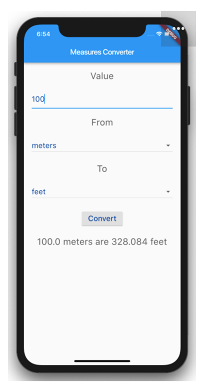

# Measures Converter (Flutter)

A clean Flutter app that converts between **Length**, **Weight**, and **Temperature** units
across metric/imperial systems. UI matches the assignment mock (Value input, From/To selects,
Convert button, and result text).

## Run

```bash
flutter pub get
flutter run
```

## Project layout

- `lib/main.dart` – UI + conversion logic
- `android/app/src/main/AndroidManifest.xml` – minimal manifest
- `pubspec.yaml` – Flutter manifest & dependencies

## GitHub

https://github.com/amityadav137/Hands-on-Assignment-1-Construct-Your-First-Flutter-App-using-Dart

## Screenshot


